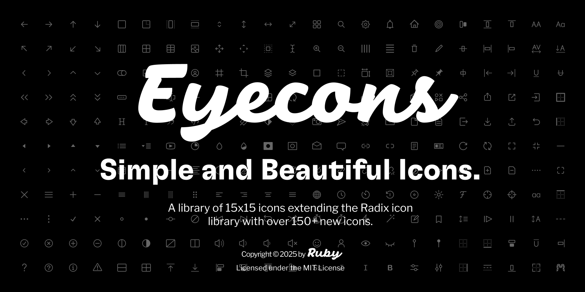

# Eyecons - The Icon Library by Ruby

<div align="center">
  


  <h2>👁️ Eyecons</h2>
  <p>A beautiful collection of 450+ simple icons extending the Radix icon library</p>
  <p>Created by <a href="https://twitter.com/rubychilds">Ruby Childs</a></p>

[](https://eyecons.rubychilds.com)
[](https://www.figma.com/community/file/1526760064955383920)
[](https://choosealicense.com/licenses/mit/)

[](https://nextjs.org/)
[](https://tailwindcss.com/)

</div>

## 🎯 About Eyecons

Eyecons is a collection of 15×15 pixel-perfect icons designed to seamlessly extend the Radix icon library, adding over 450 new icons to cover a broader range of use cases.

Created by Ruby out of a genuine love for Radix and a need for more variety, Eyecons brings consistent, thoughtful additions to help designers and developers fill in the gaps with confidence and clarity.

### ✨ Key Features

- **🎨 450+ Beautiful Icons** - Carefully designed 15x15 pixel icons
- **🔍 Smart Search** - Instantly find icons with intelligent search
- **🎨 Color Customization** - Real-time color picker for icon customization
- **📱 Responsive Design** - Works perfectly on all devices
- **⚡ Fast Performance** - Optimized for speed and accessibility
- **📦 Easy Downloads** - One-click SVG downloads
- **🏷️ Smart Tagging** - Icons are tagged for better discoverability
- **🔒 AI-Protected** - Content protected from unauthorized AI scraping

## 🚀 Live Demo

Visit [https://eyecons.rubychilds.com](https://eyecons.rubychilds.com) to explore the full icon library.

You can also check out the [Figma Community File](https://www.figma.com/community/file/1526760064955383920) to use these icons in your design projects.

## 🛠️ Built With

- **[Next.js 14](https://nextjs.org/)** - React framework for production
- **[React 18](https://reactjs.org/)** - JavaScript library for building user interfaces
- **[TypeScript](https://www.typescriptlang.org/)** - Type safety and better developer experience
- **[Tailwind CSS 3](https://tailwindcss.com/)** - Utility-first CSS framework
- **[GT-Flexa Font](https://fonts.google.com/)** - Custom typography for headers
- **[Libre Franklin](https://fonts.google.com/specimen/Libre+Franklin)** - Clean typography for body text
- **[FontAwesome](https://fontawesome.com/)** - Additional iconography
- **[Match Sorter](https://github.com/kentcdodds/match-sorter)** - Intelligent search functionality

## 🎨 Icon Categories

Our icons cover a wide range of categories:

- **UI/UX Elements** - Common interface components
- **Navigation** - Directional and menu icons
- **Communication** - Social media and messaging icons
- **Business** - Professional and corporate icons
- **Technology** - Development and tech-related icons
- **Design** - Creative and artistic icons

## 🔧 Development Setup

### Prerequisites

- Node.js 22.0.0 or higher
- Yarn package manager

### Installation

1. **Clone the repository**

   ```bash
   git clone https://github.com/rubychilds/eyecons.git
   cd eyecons
   ```

2. **Install dependencies**

   ```bash
   yarn install
   ```

3. **Run the development server**

   ```bash
   yarn dev
   ```

4. **Open in browser**

   Navigate to [http://localhost:3000](http://localhost:3000)

### Available Scripts

- `yarn dev` - Start development server
- `yarn build` - Build for production
- `yarn start` - Start production server
- `yarn lint` - Run ESLint
- `yarn lint:fix` - Fix ESLint issues
- `yarn typecheck` - Run TypeScript checks
- `yarn test` - Run tests

## 📁 Project Structure

```
eyecons/
├── src/
│   ├── components/          # Reusable React components
│   ├── icons/eyecons/       # SVG icon files
│   ├── pages/               # Next.js pages
│   ├── styles/              # CSS and styling
│   └── data/                # Icon metadata and tags
├── public/
│   ├── fonts/               # Custom font files
│   ├── opengraph-home.png   # Social media preview
│   ├── robots.txt           # Search engine directives
│   └── sitemap.xml          # Site structure for SEO
└── ...
```

## 🔍 SEO & Performance

Eyecons is built with SEO and performance in mind:

- **Comprehensive Meta Tags** - OpenGraph, Twitter Cards, and structured data
- **Optimized Images** - Proper image sizing and alt text
- **Fast Loading** - Optimized fonts and assets
- **Mobile First** - Responsive design for all devices
- **Search Engine Friendly** - Proper sitemap and robots.txt
- **AI Content Protection** - Blocks unauthorized AI crawlers

## 🤝 Want to Contribute?

We'd love your help making Eyecons even more useful. If you have ideas for new icons or want to contribute your own designs, feel free to share! Whether it's a missing symbol or a unique use case, your input helps the library grow and stay relevant to everyone's needs.

Here's how you can help:

1. **Add New Icons** - Submit SVG icons following our design guidelines
2. **Improve Search** - Enhance tagging and categorization
3. **Fix Bugs** - Report and fix issues
4. **Documentation** - Help improve our docs

### Icon Guidelines

- 15x15 pixel viewBox
- Clean, minimal design
- Consistent stroke width
- Proper SVG optimization
- Descriptive naming

## 📄 License

This project is licensed under the MIT License - see the [LICENSE](LICENSE) file for details.

## 👤 Author

**Ruby Childs**

- Twitter: [@rubychilds](https://twitter.com/rubychilds)
- GitHub: [@rubychilds](https://github.com/rubychilds)

## 🙏 Acknowledgments

- Built on the foundation of [Radix Icons](https://icons.radix-ui.com/)
- Inspired by the open-source design community
- Thanks to all contributors and users

## 🌟 Show Your Support

If you find Eyecons useful, please consider:

- ⭐ Starring the repository
- 🐦 Sharing on Twitter
- 🔗 Linking to [eyecons.rubychilds.com](https://eyecons.rubychilds.com)
- 🤝 Contributing to the project

---

<div align="center">
  <p>Made with ❤️ by Ruby Childs</p>
  <p>© 2025 Eyecons. All rights reserved.</p>
</div>
